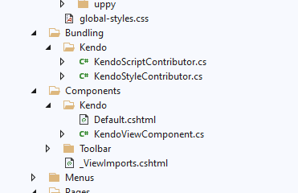
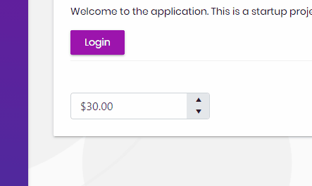

# How to Integrate the Telerik UI for ASP.NET Core (Kendo) components with the ABP MVC UI?

## Introduction

Hi, in this step by step article, we will see how we can integrate the Telerik UI for ASP.NET Core (Kendo) components with our Abp MVC app.

## Creating the Solution

> ABP Framework offers startup templates to get into business faster.

In this article, I will create a new startup template with EF Core as a database provider and MVC for UI framework. But if you already have a project with MVC UI, you don't need to create a new startup template, you can directly implement the following steps to your existing project.

> If you already have a project with the MVC UI, you can skip this section.

* Before starting to development, we will create a solution named `TelerikComponents` (or whatever you want). We will create a new startup template with EF Core as a database provider and MVC for UI framework by using [ABP CLI](https://docs.abp.io/en/abp/latest/CLI):

```bash
abp new TelerikComponents --ui mvc --database-provider ef
```

* Our project boilerplate will be ready after the download is finished. Then, we can open the solution in the Visual Studio (or any other IDE) and run the `TelerikComponents.DbMigrator` to create the database and seed initial data (which creates the admin user, admin role, permissions, etc.). I prefer changing the db connection string in the DbMigrator project to `(localdb)\\mssqllocaldb` to be able to just run right away.
```json
"ConnectionStrings": {
    "Default": "Server=(localdb)\\mssqllocaldb;Database=TelerikComponents;Trusted_Connection=True"
  },
```

* After the database and initial data created,
* Run the `TelerikComponents.Web` project to see our UI working.

> _Default login credentials for admin: username is **admin** and password is **1q2w3E\***_

## Implementation

### Pre-requisite

* First thing we need to do is downloading the [Progress Control Panel](https://www.telerik.com/download-trial-file/v2/control-panel?_ga=2.212029332.1667119438.1607582144-1944255175.1605161949) to get Telerik Kendo components on our development machine.

* If you are using Telerik UI for ASP.NET Core components for the first time or you don't have an active license you can click [here](https://www.telerik.com/login/v2/download-b?ReturnUrl=https%3a%2f%2fwww.telerik.com%2fdownload-trial-file%2fv2-b%2fui-for-blazor%3f_ga%3d2.212029332.1667119438.1607582144-1944255175.1605161949#register) to download free trial.

> You can find the more installation details from [here](https://docs.telerik.com/aspnet-core/getting-started/first-steps).

### Step 1 (Configuration)

* We need to install the `Telerik.UI.for.AspNet.Core` NuGet package to our web project (`*.Web`). We need to choose the Telerik feed package source to see the package.
* If you're using the trial, install `Telerik.UI.for.AspNet.Core.Trial` package via NuGet.


* In package.json, add the kendo script component as a dependency. This will get the scripts in your `node_modules` directory. A note, the npm package from Telerik needs to be transpiled to be able to be used so we're basically following their npm+webpack documentation [here](https://docs.telerik.com/aspnet-core/installation/npm) with a few adjustments for abp.io setup:
```json
{
	{
      "version": "1.0.0",
      "name": "my-app",
      "private": true,
      "main": "main.js",
      "devDependencies": {
        "webpack": "^5.26.3",
        "webpack-cli": "^4.5.0"
      },
      "dependencies": {
        "@volo/abp.aspnetcore.mvc.ui.theme.lepton": "^4.2.2",
        "@volo/account": "^4.2.2",
        "@volo/audit-logging": "^4.2.2",
        "@volo/identity": "^4.2.2",
        "@volo/saas": "^4.2.2",
        "@progress/kendo-theme-bootstrap": "4.33.0",
        "@progress/kendo-ui": "2021.1.225",
        "css-loader": "^5.1.3",
        "expose-loader": "^2.0.0",
        "style-loader": "^2.0.0"
      },
      "scripts": {
        "build": "webpack"
      }
    }
}
```

Create a `main.js` in the root directory, this is what webpack will use to know what to include in the [transpiled](https://scotch.io/tutorials/javascript-transpilers-what-they-are-why-we-need-them) js bundle.
```javascript
import $ from 'jquery';
window.jQuery = $; window.$ = $;

import "@progress/kendo-ui";
import "@progress/kendo-ui/js/kendo.aspnetmvc";
import "@progress/kendo-ui/js/kendo.timezones";
import "@progress/kendo-theme-bootstrap/dist/all.css";
```

Finally, add a `webpack.config.js` file to the root directory of your web project with the following content:
```javascript
"use strict"
{
    const path = require('path');
    const webpack = require('webpack');

    module.exports = {
        entry: './main.js',
        output: {
            filename: 'kendo-bundle.js',
            path: path.resolve(__dirname, 'wwwroot/libs/kendo/dist')
        },
        module: {
            rules: [
                {
                    test: /\.css$/,
                    use: [{ loader: 'style-loader' }, { loader: 'css-loader' }]
                },
                {
                    test: /jquery.+\.js$/,
                    use: [{
                        loader: 'expose-loader',
                        options: 'jQuery'
                    }, {
                        loader: 'expose-loader',
                        options: '$'
                    }]
                }
            ]
        },
        externals: {
            jquery: 'jQuery'
        }
    }
}
```

What this will do is create a single js file that contains all of kendo, transpiled so you don't get 'module' errors. The use of `expose-loader`, `externals jquery` and the jquery rules are all there so that abp.io scripts, the way jquery is added and how kendo's js generally includes jquery doesn't conflict with each other.

* In the `abp.resourcemapping.js` file, add the necessary entries that look like the following:
```javascript
module.exports = {
    aliases: {
    },
    mappings: {
        "@node_modules/@progress/kendo-ui/css/**/*": "@libs/kendo/css",
        "@node_modules/@progress/kendo-ui/js/**/*": "@libs/kendo/js"
    }
};
```
  This will ensure the scripts and styles we need are packed up and in the right place for the next steps.
  
* Run `yarn` (to get the package)
* Run `gulp` (to execute the mapping)
* Run `npm build` (to execute the conversion of the js from Telerik into something usable here)

* In the `TelerikComponents.Web` project, under `/Bundling`, create a new directory we'll call `Kendo`- i.e. `/Bundling/Kendo`



* In `/Bundling/Kendo`, create the class file `KendoScriptContributer.cs` with the following content:
```csharp
namespace TelerikComponets.Web.Bundling
{
    [DependsOn(
        typeof(JQueryScriptContributor)
        )]
    public class KendoScriptContributor : BundleContributor
    {
        public override void ConfigureBundle(BundleConfigurationContext context)
        {
            context.Files.AddIfNotContains("/libs/kendo/dist/kendo-bundle.js"); // This is the output of our webpack step
        }
    }
}
```
* In `/Bundling/Kendo`, create the class file `KendoStyleContributer.cs` with the following content:
```csharp
namespace TelerikComponents.Web.Bundling
{
  public class KendoStyleContributor : BundleContributor
  {
      public override void ConfigureBundle(BundleConfigurationContext context)
      {
          context.Files.AddIfNotContains("/libs/kendo/css/web/kendo.common-bootstrap.min.css");
          context.Files.AddIfNotContains("/libs/kendo/css/web/kendo.bootstrap-v4.min.css");
      }
  }
}
```
* In the `TelerikComponents.Web` project, under `/Components`, create a new directory we'll call `Kendo` - i.e. `/Components/Kendo`
* Create a `Default.cshtml` with the following content:
```html
@using TelerikComponents.Web.Bundling.Kendo 
@addTagHelper *, Volo.Abp.AspNetCore.Mvc.UI.Bundling

<!-- Kendo -->
<abp-script type="typeof(KendoScriptContributor)" />
```
* Create a KendoViewComponent.cs with the following content:
```csharp
public class KendoViewComponent : AbpViewComponent
{
    public IViewComponentResult Invoke()
    {
        return View("/Components/Kendo/Default.cshtml");
    }
}
```
* In `/Pages/_ViewImports.cshtml` add the tag helper:
```csharp
@using Kendo.Mvc.UI
@addTagHelper "*, Kendo.Mvc"
```
* Finally, in your `TelerikComponentsWebModule.cs` file - let's add the following bits:
  * In `ConfigureServices`, add `ConfigureKendo(context.Services);`. The method implementation looks simply like this:
```csharp
private void ConfigureKendo(IServiceCollection services)
{
    services.AddKendo();
}
```

  * Find the area `Configure<AbpBundlingOptions>` and after the `Global` add, also add our style contributor `.AddContributors(typeof(KendoStyleContributor))`:
```csharp
Configure<AbpBundlingOptions>(options =>
{
    options
        .StyleBundles
        .Get(StandardBundles.Styles.Global)
        .AddContributors(typeof(KendoStyleContributor)); // add this
});
```

  If you don't see this section, add it to `ConfigureServices()`.
    * Add a new configure to setup a [layout hook](https://docs.abp.io/en/abp/latest/UI/AspNetCore/Layout-Hooks), where we add the kendo scripts to the bottom of the page:
    
```csharp
Configure<AbpLayoutHookOptions>(options =>
{
    options.Add(
        LayoutHooks.Head.Last, //The hook name
        typeof(KendoViewComponent) //The component to add
    );
});
```


### Step 2 - Checking the Setup

If we've done everything right, then we should now be able to use the components. On any page, you should now be able to use either the tag helpers or razor syntax:

```html
<kendo-numerictextbox name="currency" format="c" min="0"
      enable="true" max="100" value="30">
</kendo-numerictextbox>
```

```html
@(Html.Kendo().NumericTextBox()
      .Name("currency")
      .Format("c")
      .Min(0) // Set the min value of the NumericTextBox.
      .Max(100) // Set the min value of the NumericTextBox.
      .Value(30) // Set the value of the NumericTextBox.
)
```

# Done!
